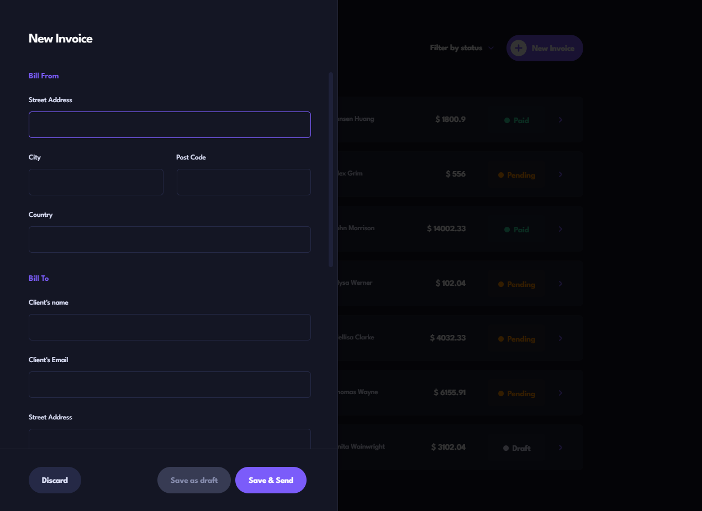

# Invoice Manager

## Overview

Invoice Manager is a web application designed to simplify the process of creating, managing, and tracking invoices. It provides an intuitive interface for users to manage their financial documents efficiently, with features that streamline the invoicing process.

## Features

1. **Create Invoices:**

   - Generate professional invoices with ease.
   - Include crucial details such as client name, email, and address.
   - Specify the work done for the client, invoice date, and payment terms.

2. **Manage Invoices:**

   - Update existing invoices with new information or corrections.
   - Mark invoices as paid to keep track of payments.
   - Delete invoices that are no longer needed, ensuring your records are up-to-date and accurate.

3. **Filter Invoices:**

   - Easily filter through your invoices to find those that are paid, pending, or in draft status.

4. **Light/Dark Mode:**

   - Toggle between light and dark modes to suit your visual preference and reduce eye strain.

5. **Responsive Design:**
   - Experience a fully responsive interface that looks great on any device.
   - Benefit from stunning visuals and a seamless user experience, whether you’re using a desktop, tablet, or smartphone.

## Screenshots


_Dashboard Overview_


_Create a New Invoice_

## Installation

To get started with the Invoice Manager, follow these steps:

1. **Clone the repository:**
   ```bash
   git clone https://github.com/dev-anurag-singh/invoice-manager.git
   ```
2. **Install the dependencies:**
   ```bash
   npm install
   ```
3. **Start the development server:**
   ```bash
   npm run dev
   ```

The application should now be running on http://localhost:3000.
